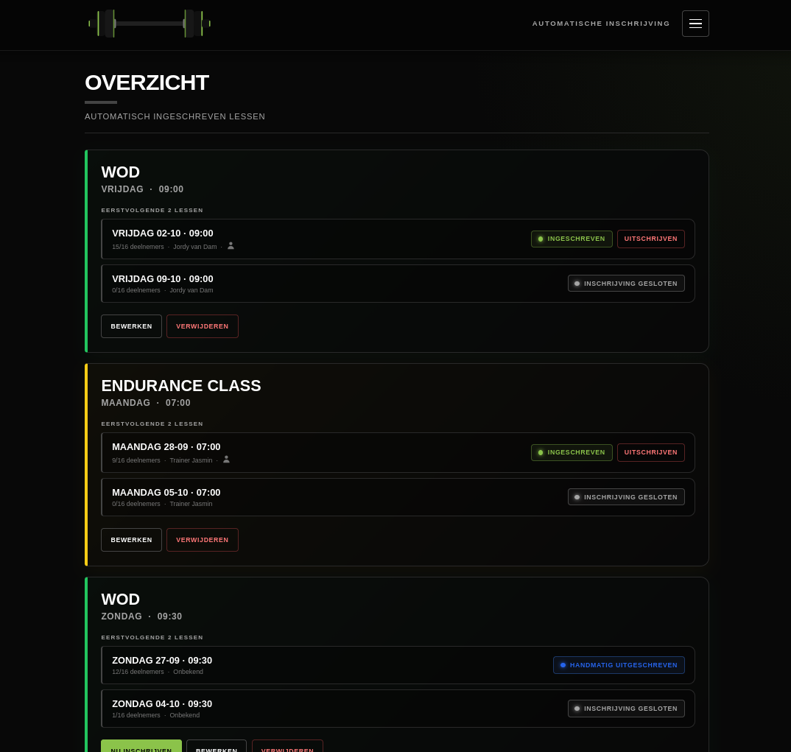
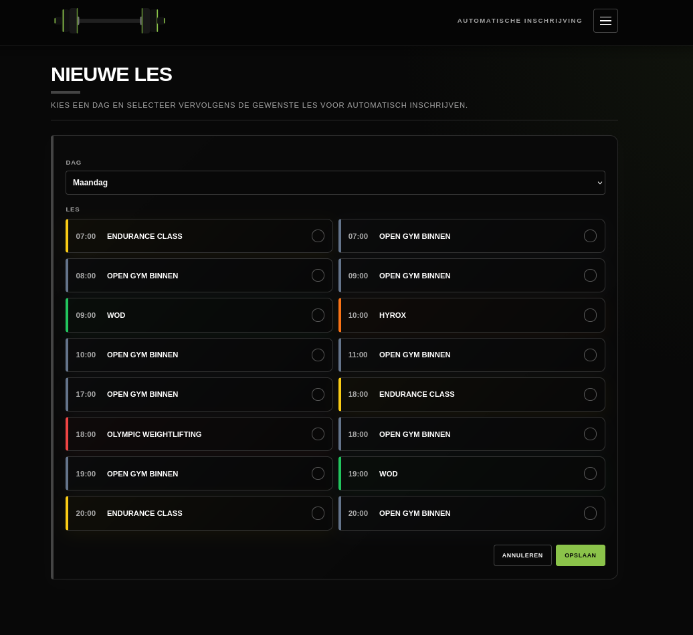

# SportBit Go Personal

Een lichte Flask-webapplicatie voor het automatisch inschrijven en uitschrijven van lessen in SportBit.

De applicatie is bedoeld om op een kleine server, Raspberry Pi, NAS of andere Linux-machine te draaien. Via een mobiele webinterface kunnen inschrijvingen worden ingesteld en gecontroleerd. Een ingebouwde scheduler voert de automatische inschrijvingen dagelijks uit.





---

## Functies

- Automatisch inschrijven voor SportBit-lessen.
- Automatisch controleren van de eerstvolgende lessen.
- Tonen van de eerstvolgende twee lessen per inschrijving.
- Tonen van:
  - aantal deelnemers;
  - maximale capaciteit;
  - trainer;
  - buddy-status.
- Handmatig inschrijven vanuit de webinterface.
- Handmatig uitschrijven.
- Inschrijvingen toevoegen, aanpassen en verwijderen.
- Ingebouwde dagelijkse scheduler.
- Instelbare scheduler-tijd en tijdzone.
- Permanente logging.
- Live logpagina in de webinterface.
- Optionele web-login.
- CSRF-bescherming voor formulieren.
- Mobielvriendelijke interface.
- Documentatiepagina in de applicatie.
- Optionele e-mail/testmail-functionaliteit.

---

## Werking

De applicatie bestaat uit een Flask-webinterface en een aantal losse Python-modules voor de SportBit-logica.

In grote lijnen werkt de applicatie als volgt:

1. De configuratie wordt ingelezen.
2. De applicatie bepaalt voor iedere ingestelde les wanneer de eerstvolgende les plaatsvindt.
3. SportBit wordt gecontroleerd op de betreffende lessen.
4. De status van de les wordt bepaald, bijvoorbeeld:
   - ingeschreven;
   - wachtlijst;
   - beschikbaar;
   - vol;
   - niet ingeschreven.
5. De webinterface toont de actuele situatie.
6. De ingebouwde scheduler controleert op het ingestelde tijdstip automatisch alle inschrijvingen.
7. Wanneer een doel-les beschikbaar is, wordt geprobeerd automatisch in te schrijven.
8. Een succesvol afgehandelde inschrijving wordt opgeslagen zodat dezelfde les niet opnieuw automatisch wordt verwerkt.
9. Alle relevante acties worden naar het logbestand geschreven.

De scheduler draait als achtergrondthread binnen hetzelfde Flask-process. Er is daardoor geen aparte cronjob nodig.

---

## Projectstructuur

Een vereenvoudigde structuur:

```text
sportbit/
├── sportbit_webapp.py
├── sportbit_api.py
├── sportbit_config.py
├── sportbit_dates.py
├── sportbit_events.py
├── sportbit_registration.py
├── sportbit_automation_state.py
├── sportbit_state.py
├── notify.py
│
├── templates/
│   ├── base.html
│   ├── index.html
│   ├── edit.html
│   ├── settings.html
│   ├── documentation.html
│   └── log.html
│
├── static/
│   ├── css/
│   ├── js/
│   └── images/
│
├── logs/
│   └── sportbit.log
│
├── .env
├── .flask_secret_key
└── ...
```

De exacte bestandsindeling kan per installatie verschillen.

---

# Installatie

## 1. Python installeren

De applicatie gebruikt Python 3.

Op Debian/Ubuntu bijvoorbeeld:

```bash
sudo apt update
sudo apt install python3 python3-venv python3-pip
```

Controleer:

```bash
python3 --version
```

---

## 2. Project downloaden

Plaats de applicatie bijvoorbeeld in:

```text
/opt/sportbit
```

Bijvoorbeeld:

```bash
sudo mkdir -p /opt/sportbit
sudo chown "$USER":"$USER" /opt/sportbit
cd /opt/sportbit
```

Plaats vervolgens de projectbestanden in deze directory.

---

## 3. Virtuele Python-omgeving

Maak een virtual environment:

```bash
python3 -m venv venv
```

Activeer deze:

```bash
source venv/bin/activate
```

Installeer daarna de benodigde Python-packages.

Als er een `requirements.txt` aanwezig is:

```bash
pip install -r requirements.txt
```

---

## 4. Configuratie

Maak een `.env` bestand in de hoofdmap van de applicatie.

De belangrijkste instellingen zijn de SportBit-inloggegevens en eventueel de web-login.

Bijvoorbeeld:

```env
SPORTBIT_USERNAME=jouw_sportbit_gebruikersnaam
SPORTBIT_PASSWORD=jouw_sportbit_wachtwoord

WEB_USERNAME=admin
WEB_PASSWORD=een-sterk-wachtwoord
```

Gebruik voor echte wachtwoorden uiteraard geen voorbeeldwaarden.

### Web-login

`WEB_USERNAME` en `WEB_PASSWORD` zijn optioneel.

Wanneer deze niet zijn ingesteld, is de webinterface toegankelijk zonder login.

Wanneer beide zijn ingesteld, wordt de webinterface achter een login geplaatst.

Dit is vooral belangrijk wanneer de applicatie vanaf andere apparaten of buiten localhost bereikbaar is.

---

## 5. Flask secret key

De applicatie gebruikt een permanente Flask secret key.

Wanneer `FLASK_SECRET_KEY` niet in `.env` staat, wordt automatisch een willekeurige sleutel aangemaakt en opgeslagen in:

```text
.flask_secret_key
```

Dit bestand moet daarom behouden blijven wanneer de applicatie wordt verplaatst of opnieuw gestart.

Eventueel kan zelf een sleutel worden ingesteld:

```env
FLASK_SECRET_KEY=een-lange-willekeurige-geheime-sleutel
```

De secret key en `.env` mogen niet publiek worden gedeeld.

---

# Starten

Activeer de virtual environment:

```bash
cd /opt/sportbit
source venv/bin/activate
```

Start daarna:

```bash
python3 sportbit_webapp.py
```

De webinterface is vervolgens bereikbaar via het adres waarop Flask luistert.

Bij gebruik binnen een lokaal netwerk kan de applicatie bijvoorbeeld via het IP-adres van de server worden geopend.

---

# Scheduler

De scheduler is onderdeel van de applicatie.

Er is dus geen aparte cronjob nodig.

In de instellingen kunnen de schedulerinstellingen worden aangepast, waaronder:

- aan/uit;
- tijd waarop de automatische controle wordt uitgevoerd;
- tijdzone.

De scheduler controleert periodiek de instellingen en voert maximaal één automatische run per kalenderdag uit op het ingestelde tijdstip.

De scheduler gebruikt de ingestelde tijdzone in plaats van blind de systeemtijd te gebruiken.

---

# Status en automatische inschrijving

Voor iedere geconfigureerde inschrijving wordt gekeken naar de eerstvolgende relevante les.

De applicatie houdt daarbij rekening met de actuele SportBit-status.

Een automatisch verwerkte les wordt als afgehandeld opgeslagen. Hierdoor wordt dezelfde les niet bij iedere schedulercontrole opnieuw geprobeerd.

Wanneer een les nog niet beschikbaar is, wordt deze niet als succesvol afgehandeld gemarkeerd. Een volgende controle kan de les daardoor opnieuw proberen.

Een handmatige annulering kan eveneens als overgeslagen worden opgeslagen.

---

# Webinterface

De interface bestaat uit verschillende onderdelen.

## Overzicht

Op de overzichtspagina staat per ingestelde les:

- lesnaam;
- vaste dag en tijd;
- eerstvolgende twee lessen;
- deelnemersaantal;
- maximale capaciteit;
- trainer;
- buddy-status;
- actuele inschrijfstatus.

Daarnaast zijn acties beschikbaar voor inschrijven, bewerken en verwijderen.

Op kleine schermen worden de actieknoppen standaard ingeklapt. De belangrijkste informatie blijft zichtbaar zodat de pagina compact blijft op een telefoon.

Op grotere schermen blijft de volledige kaart zichtbaar.

---

## Bewerken

Via **Bewerken** kunnen de eigenschappen van een automatische inschrijving worden aangepast:

- dag;
- tijd;
- les.

Bij het kiezen van een dag en tijd kan SportBit worden geraadpleegd om beschikbare lessen te tonen.

---

## Instellingen

De instellingenpagina bevat de configuratie die tijdens runtime aangepast kan worden.

Wijzigingen worden naar de configuratie opgeslagen en relevante modules worden opnieuw geladen zodat nieuwe instellingen direct beschikbaar zijn voor het huidige Flask-process.

---

## Log

De applicatie gebruikt een permanent logbestand:

```text
logs/sportbit.log
```

Het logbestand gebruikt rotating logging zodat het bestand niet onbeperkt blijft groeien.

Daarnaast is er een logpagina in de webinterface.

Hierop kan de recente uitvoer van de applicatie worden bekeken.

De applicatie logt onder andere:

- webrequests;
- scheduleracties;
- automatische inschrijvingen;
- fouten;
- SportBit-acties;
- wijzigingen in schedulerinstellingen.

---

# Beveiliging

De applicatie bevat een aantal eenvoudige beveiligingsmaatregelen.

### Web-login

Optioneel kan een gebruikersnaam en wachtwoord worden ingesteld via:

```env
WEB_USERNAME=...
WEB_PASSWORD=...
```

### CSRF-bescherming

POST-, PUT-, PATCH- en DELETE-aanvragen worden voorzien van een CSRF-token.

Hierdoor worden formulieren beschermd tegen ongewenste aanvragen vanaf andere websites.

### Sessiecookie

De Flask-sessie gebruikt:

- `HttpOnly`;
- `SameSite=Lax`.

Wanneer de applicatie achter HTTPS draait, kan bovendien worden ingesteld:

```env
SESSION_COOKIE_SECURE=true
```

### Secret key

De Flask secret key wordt niet hardcoded in de applicatie.

---

# Designkeuzes

## Flask

Flask is gebruikt omdat de applicatie relatief klein is en voornamelijk bestaat uit:

- een webinterface;
- enkele formulieren;
- API-endpoints;
- SportBit-integratie;
- een achtergrondproces.

Een grote webframework-stack zou hiervoor onnodige complexiteit toevoegen.

---

## Losse Python-modules

De SportBit-logica is verdeeld over meerdere modules.

Onder andere:

```text
sportbit_api.py
sportbit_events.py
sportbit_registration.py
sportbit_config.py
sportbit_dates.py
sportbit_state.py
sportbit_automation_state.py
```

Hierdoor zijn API-aanroepen, datumlogica, registratie, configuratie en statusbeheer zoveel mogelijk van elkaar gescheiden.

Dit maakt wijzigingen en foutzoeken eenvoudiger.

---

## Ingebouwde scheduler

Er is bewust gekozen voor een scheduler binnen de Flask-app in plaats van een aparte cronjob.

Voordelen:

- één applicatie om te beheren;
- schedulerinstellingen zijn vanuit de webinterface beschikbaar;
- geen aparte cronconfiguratie;
- logging gebeurt op dezelfde plek als de rest van de applicatie;
- wijzigingen kunnen tijdens runtime worden opgepakt.

De scheduler wordt slechts één keer gestart binnen het process en gebruikt een lock om dubbele uitvoering te voorkomen.

---

## Permanente status

Automatische acties worden niet alleen in het geheugen bijgehouden.

De applicatie bewaart ook welke lessen al zijn afgehandeld en welke handmatig zijn overgeslagen.

Daardoor kan de applicatie na een herstart verdergaan zonder automatisch dezelfde les opnieuw te behandelen.

---

## Mobiel ontwerp

De interface is ontworpen als een compacte mobiele webapp in plaats van als een traditionele desktopwebsite.

Belangrijke informatie staat direct zichtbaar in de kaarten.

Op mobiel:

- blijven lesnaam en planning zichtbaar;
- blijven de eerstvolgende lessen zichtbaar;
- worden minder belangrijke actieknoppen ingeklapt;
- kan een kaart met één duidelijke pijl worden geopend;
- blijft de titel links uitgelijnd zoals op desktop.

Op desktop wordt de beschikbare ruimte beter benut en blijven de acties zichtbaar.

---

## Geen onnodige API-calls

Waar mogelijk wordt informatie die al beschikbaar is in een SportBit-event direct gebruikt.

Bijvoorbeeld:

```python
event["trainer"]
event["aantalDeelnemers"]
event["maxDeelnemers"]
event["buddyAangemeld"]
```

Daardoor is geen aparte API-call nodig om trainer- of buddyinformatie op te halen.

---

## Logging

Logging is bewust een vast onderdeel van de applicatie.

Een automatische inschrijving is een proces dat soms buiten beeld plaatsvindt. Daarom moet achteraf kunnen worden nagegaan:

- wanneer de scheduler draaide;
- welke inschrijving werd geprobeerd;
- wat SportBit terug gaf;
- waarom een actie wel of niet werd uitgevoerd;
- of er fouten zijn opgetreden.

De logpagina maakt deze informatie ook vanaf een telefoon toegankelijk.

---

# Productiegebruik

Voor langdurig gebruik is het aan te raden de applicatie als service te starten, bijvoorbeeld met systemd of een andere process manager.

De applicatie moet daarbij automatisch starten na een reboot.

Wanneer de webinterface buiten het lokale netwerk beschikbaar wordt gemaakt, gebruik dan bij voorkeur:

- HTTPS;
- een reverse proxy;
- een sterke web-login;
- `SESSION_COOKIE_SECURE=true`.

Zorg daarnaast dat `.env` en `.flask_secret_key` niet publiek toegankelijk zijn.

---

# Belangrijk

Deze applicatie automatiseert acties op een extern SportBit-account.

Controleer daarom altijd de instellingen voordat automatische inschrijving wordt ingeschakeld.

Controleer in het bijzonder:

- de juiste SportBit-accountgegevens;
- de juiste lessen;
- de juiste dag en tijd;
- de schedulerinstellingen;
- de tijdzone.

De applicatie voert alleen acties uit volgens de ingestelde configuratie.
