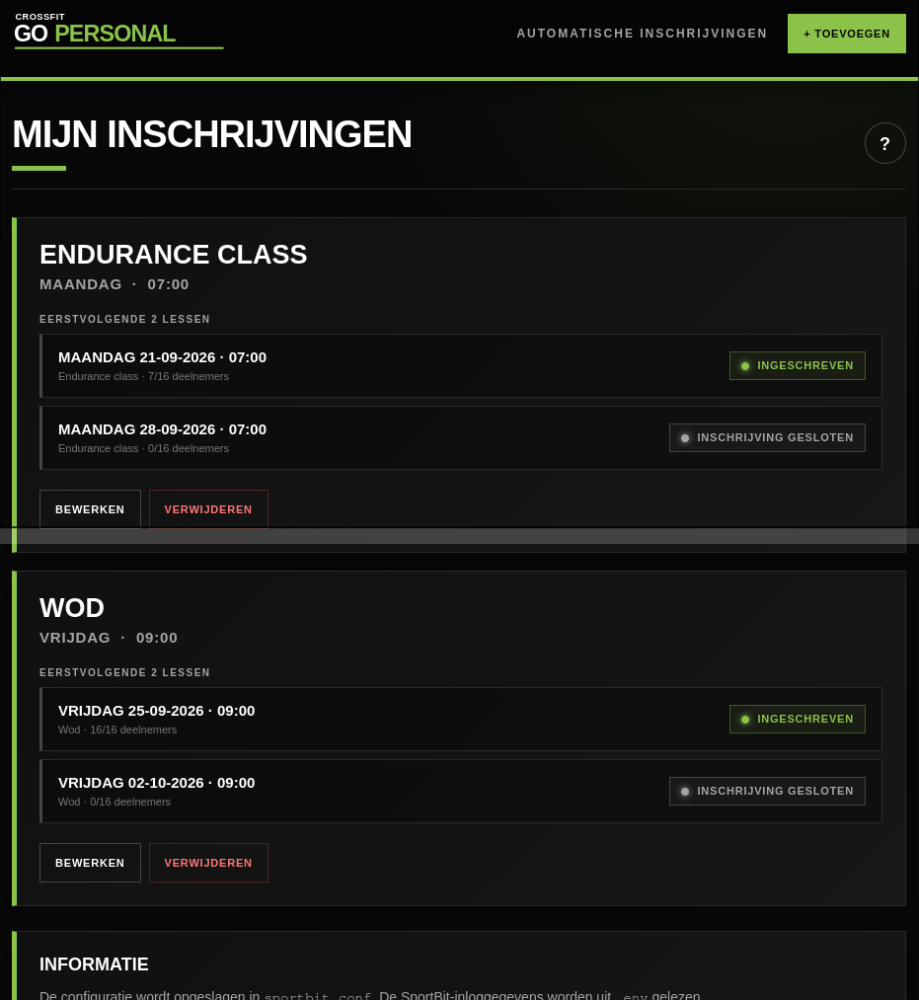

# Go Personal · SportBit

Een Flask-webapp voor het automatisch beheren en uitvoeren van SportBit-inschrijvingen voor CrossFit Go Personal.

De applicatie houdt geconfigureerde lessen bij, controleert de eerstvolgende lessen in SportBit en kan automatisch proberen in te schrijven zodra de inschrijving opent. Bij bepaalde problemen kan een e-mailnotificatie worden verstuurd.



---

## Inhoudsopgave

- [Functionaliteit](#functionaliteit)
- [Hoe werkt het?](#hoe-werkt-het)
- [Inschrijvingen configureren](#inschrijvingen-configureren)
- [Automatische lescontrole](#automatische-lescontrole)
- [Boekingsmoment](#boekingsmoment)
- [Eerstvolgende twee lessen](#eerstvolgende-twee-lessen)
- [Statussen](#statussen)
- [Dagelijkse controle](#dagelijkse-controle)
- [Technische fouten](#technische-fouten)
- [E-mailnotificaties](#e-mailnotificaties)
- [Installatie](#installatie)
- [Configuratie](#configuratie)
- [Starten](#starten)
- [Productie](#productie)
- [Webinterface](#webinterface)
- [Statuscache](#statuscache)
- [Beveiliging](#beveiliging)
- [Projectstructuur](#projectstructuur)
- [Belangrijke ontwerpkeuzes](#belangrijke-ontwerpkeuzes)
- [Licentie](#licentie)
- [Disclaimer](#disclaimer)

---

## Functionaliteit

- 📅 Lessen configureren op **weekdag + tijd + lesnaam**
- 🔎 Lessen in SportBit zoeken op **lesnaam en starttijd**
- 📝 Automatisch inschrijven zodra de boekingsperiode opent
- 👥 Herkenning van verschillende inschrijvingsstatussen:
  - Ingeschreven
  - Wachtlijst
  - Niet ingeschreven
  - Inschrijving gesloten
  - Geen event
  - Status onbekend
- 📆 De eerstvolgende twee lessen per inschrijving tonen
- 🔄 Statuscontrole met een **cache van 5 minuten**
- ⏰ Dagelijkse controle rond **00:01**
- 📧 E-mailnotificaties bij ontbrekende lessen of mislukte inschrijvingen
- 🧪 Handmatig een testmail versturen
- 📋 De laatste SportBit-activiteit bekijken vanuit de webinterface
- ✏️ Inschrijvingen toevoegen, aanpassen en verwijderen via de webinterface
- 📱 Responsive interface voor desktop en mobiel
- 📲 Basis-PWA-functionaliteit met service worker en webmanifest

---

## Hoe werkt het?

De applicatie bestaat uit een Flask-webinterface en een SportBit-integratie.

Globaal werkt het als volgt:

```text
sportbit.conf
      │
      ▼
 Flask webapp
      │
      ├──► SportBit API
      │       │
      │       └──► lessen / inschrijvingen / wachtlijst
      │
      ├──► statusweergave
      │
      └──► automatische inschrijving
                  │
                  ▼
              notify.py
                  │
                  └──► e-mail
```

---

## Inschrijvingen configureren

Iedere inschrijving bestaat uit:

- een **weekdag**
- een **tijd**
- een **lesnaam**

Bijvoorbeeld:

```ini
[inschrijving_1]
dag = maandag
tijd = 07:00
les = Crossfit
```

De configuratie wordt opgeslagen in:

```text
sportbit.conf
```

Nieuwe inschrijvingen kunnen ook via de webinterface worden toegevoegd.

---

## Automatische lescontrole

Voor iedere configuratie wordt de eerstvolgende les bepaald.

De applicatie zoekt vervolgens in SportBit naar een event dat overeenkomt met:

```text
lesnaam + starttijd + datum
```

De event-ID wordt dus **niet vooraf opgeslagen**.

Dit is bewust zo gedaan. Hierdoor kan de applicatie blijven werken wanneer SportBit nieuwe events aanmaakt.

De vergelijking van de lesnaam is hoofdletterongevoelig.

De volgende namen worden bijvoorbeeld als dezelfde les beschouwd:

```text
Crossfit
CROSSFIT
crossfit
```

---

## Boekingsmoment

De applicatie gaat ervan uit dat een les **7 dagen van tevoren** boekbaar wordt.

Voor een les op:

```text
maandag 07:00
```

wordt vanaf:

```text
maandag 00:00
```

gecontroleerd of inschrijven mogelijk is.

De daadwerkelijke inschrijving wordt vervolgens door de SportBit-integratie uitgevoerd.

De applicatie controleert daarbij eerst opnieuw of de les daadwerkelijk bestaat.

Als de verwachte les niet wordt gevonden, wordt **niet** geprobeerd om op een willekeurig ander event in te schrijven.

---

## Eerstvolgende twee lessen

Op de hoofdpagina worden per configuratie de twee eerstvolgende lessen weergegeven.

Bijvoorbeeld:

```text
MAANDAG · 07:00

Eerstvolgende 2 lessen

MAANDAG 21-09-2026 · 07:00
Crossfit · 8/12 deelnemers
INGESCHREVEN

MAANDAG 28-09-2026 · 07:00
Crossfit · 5/12 deelnemers
INSCHRIJVING GESLOTEN
```

De status wordt rechtstreeks uit de SportBit-response bepaald.

---

## Statussen

De webapp gebruikt de volgende statussen:

| Status | Betekenis |
|---|---|
| **INGESCHREVEN** | Je bent aangemeld voor de les |
| **WACHTLIJST** | Je staat op de wachtlijst |
| **NIET INGESCHREVEN** | De les bestaat en inschrijven is mogelijk |
| **INSCHRIJVING GESLOTEN** | De les bestaat, maar het boekingsmoment is nog niet geopend |
| **GEEN EVENT** | De verwachte les is niet gevonden |
| **STATUS ONBEKEND** | De controle kon niet betrouwbaar worden uitgevoerd |

---

## Dagelijkse controle

Naast de controle die plaatsvindt wanneer de webpagina wordt geopend, draait er een achtergrondthread.

Deze controle kijkt dagelijks rond:

```text
00:01
```

voor welke lessen die dag de boekingsperiode opent.

Als de verwachte les niet wordt gevonden, wordt er **geen automatische inschrijving** uitgevoerd.

In plaats daarvan kan een notificatie worden verstuurd.

Dit voorkomt bijvoorbeeld dat de applicatie bij een gewijzigde feestdag-WOD probeert in te schrijven voor een verkeerde les.

---

## Technische fouten

Een netwerkfout of andere technische fout wordt **niet automatisch geïnterpreteerd als `GEEN EVENT`**.

Dit onderscheid is belangrijk.

Een tijdelijke SportBit-storing betekent immers niet dat de les daadwerkelijk ontbreekt.

Daarom worden technische fouten en ontbrekende events afzonderlijk behandeld.

---

## E-mailnotificaties

De e-mailfunctionaliteit staat in:

```text
notify.py
```

De SportBit- en Flask-logica blijft daarmee gescheiden van de notificatielogica.

Er zijn onder andere notificaties voor:

### Ontbrekende les

Wanneer de dagelijkse controle de verwachte les niet vindt.

### Mislukte inschrijving

Wanneer een daadwerkelijke automatische inschrijfpoging mislukt of niet kan worden bevestigd.

### Testmail

Via de webinterface kan handmatig een testmail worden verstuurd om de SMTP-configuratie te controleren.

### Dubbele meldingen voorkomen

Voor ontbrekende lessen wordt bijgehouden welke melding al is verstuurd.

Dit gebeurt via:

```text
notify_state.json
```

Hierdoor kan een herhaalde controle niet steeds opnieuw dezelfde melding versturen.

---

# Installatie

## Vereisten

Je hebt nodig:

- Python 3
- Toegang tot een SportBit-account
- Een SMTP-account voor notificaties
- Een server of computer waarop de applicatie kan blijven draaien

## Repository clonen

```bash
git clone https://github.com/jeweet/sportbit.git
cd REPOSITORY
```

---

## Virtuele omgeving

Het is aanbevolen om een virtual environment te gebruiken:

```bash
python3 -m venv .venv
```

### Linux / macOS

```bash
source .venv/bin/activate
```

### Windows

```powershell
.venv\Scripts\activate
```

---

## Dependencies installeren

Installeer de benodigde Python-packages:

```bash
pip install flask python-dotenv requests
```

Als `sportbit2` en `notify` externe packages zijn, installeer deze volgens de bijbehorende documentatie.

Als ze onderdeel zijn van deze repository, moeten de bestanden bijvoorbeeld aanwezig zijn als:

```text
sportbit2.py
notify.py
```

---

# Configuratie

De applicatie gebruikt twee belangrijke configuratiebestanden:

- `.env` — gevoelige gegevens
- `sportbit.conf` — geconfigureerde lessen

---

## `.env`

Gevoelige gegevens zoals login- en SMTP-instellingen horen in `.env`.

Voorbeeld:

```dotenv
SPORTBIT_USERNAME=jouw_gebruikersnaam
SPORTBIT_PASSWORD=jouw_wachtwoord

FLASK_SECRET_KEY=vervang-dit-door-een-lange-willekeurige-string

SMTP_HOST=smtp.example.com
SMTP_PORT=587
SMTP_USERNAME=jouw-email@example.com
SMTP_PASSWORD=jouw-smtp-wachtwoord
SMTP_FROM=jouw-email@example.com
SMTP_TO=jouw-email@example.com
```

De exacte variabelen zijn afhankelijk van de implementatie van `sportbit2.py` en `notify.py`.

> **Let op:** commit nooit je echte `.env` naar GitHub.

Voeg bijvoorbeeld het volgende toe aan `.gitignore`:

```gitignore
.env
.venv/
__pycache__/
*.pyc
sportbit.conf
notify_state.json
```

---

## `sportbit.conf`

De lessen worden opgeslagen in `sportbit.conf`.

Voorbeeld:

```ini
[inschrijving_1]
dag = maandag
tijd = 07:00
les = Crossfit

[inschrijving_2]
dag = woensdag
tijd = 19:00
les = Crossfit
```

Je kunt deze configuratie handmatig aanpassen, maar normaal gesproken kan dit via de webinterface.

---

# Starten

Start de applicatie met:

```bash
python3 app.py
```

De Flask-server luistert standaard op:

```text
0.0.0.0:5000
```

Open vervolgens in de browser:

```text
http://localhost:5000
```

Vanaf een ander apparaat in hetzelfde netwerk kan de server bijvoorbeeld worden geopend via:

```text
http://<IP-ADRES-VAN-DE-SERVER>:5000
```

---

# Productie

Voor productie wordt aanbevolen om Flask niet rechtstreeks met de ingebouwde development server te draaien.

Gebruik bijvoorbeeld Gunicorn:

```bash
pip install gunicorn
```

Daarna:

```bash
gunicorn -w 1 -b 0.0.0.0:5000 app:app
```

## Waarom `-w 1`?

De dagelijkse SportBit-controle wordt momenteel gestart als een Python-backgroundthread:

```python
start_dagelijkse_controle()
```

Meerdere Gunicorn-workers zouden ieder hun eigen backgroundthread kunnen starten.

Dat kan ertoe leiden dat dezelfde dagelijkse controle meerdere keren wordt uitgevoerd.

Voor de huidige architectuur is daarom **één worker** het eenvoudigst.

Voor een grotere productieomgeving zou de scheduler beter als aparte service kunnen worden uitgevoerd.

---

# Webinterface

De applicatie bevat onder andere de volgende onderdelen:

### Mijn inschrijvingen

Toont alle geconfigureerde lessen en de status van de eerstvolgende twee lessen.

### Toevoegen

Nieuwe automatische inschrijving configureren.

### Bewerken

Bestaande inschrijving aanpassen.

### Verwijderen

Een configuratie verwijderen.

### Documentatie

Uitleg over de werking van de automatische controles en notificaties.

### Laatste log

Toont de laatste uitvoer van een daadwerkelijke SportBit-inschrijfpoging.

### Testmail

Stuurt handmatig een testmail via de geconfigureerde SMTP-server.

---

# Statuscache

De controle van de SportBit-status wordt maximaal één keer per **5 minuten** uitgevoerd per inschrijving.

Dit wordt geregeld met:

```python
STATUS_CACHE_SECONDS = 5 * 60
```

De cache staat alleen in het geheugen.

Na een restart van de applicatie wordt de cache opnieuw opgebouwd.

---

# Beveiliging

Deze applicatie verwerkt gevoelige gegevens.

Let daarom op het volgende:

- Zet SportBit-wachtwoorden niet rechtstreeks in Python-code.
- Commit `.env` niet naar Git.
- Commit SMTP-wachtwoorden niet naar Git.
- Zet `sportbit.conf` niet openbaar als daarin persoonlijke gegevens staan.
- Gebruik HTTPS wanneer de webinterface buiten een vertrouwd lokaal netwerk beschikbaar wordt gemaakt.
- Gebruik een sterke `FLASK_SECRET_KEY`.
- Beperk indien mogelijk de toegang tot de Flask-webinterface.
- De standaard Flask development server is niet bedoeld als volledige productie-infrastructuur.

---

# Projectstructuur

Een mogelijke structuur:

```text
.
├── app.py
├── sportbit2.py
├── notify.py
├── sportbit.conf
├── .env
├── static/
│   ├── manifest.json
│   ├── icon.svg
│   └── sw.js
└── README.md
```

| Bestand | Functie |
|---|---|
| `app.py` | Flask-webapp, configuratie en scheduler |
| `sportbit2.py` | SportBit-login, API-communicatie en inschrijving |
| `notify.py` | E-mailnotificaties |
| `sportbit.conf` | Geconfigureerde lessen |
| `.env` | Gevoelige configuratie |
| `static/manifest.json` | PWA-configuratie |
| `static/sw.js` | Service worker |
| `static/icon.svg` | PWA/browsericoon |

---

# Belangrijke ontwerpkeuzes

## Geen vooraf opgeslagen event-ID

De applicatie slaat geen SportBit-event-ID op voor toekomstige lessen.

Een event wordt iedere keer gezocht op:

```text
lesnaam
+
starttijd
+
datum
```

Dit maakt de configuratie minder afhankelijk van tijdelijke SportBit-event-ID's.

---

## Geen blind automatisch inschrijven

Als de verwachte les niet wordt gevonden, wordt niet geprobeerd om een ander event te boeken.

Dit is vooral belangrijk rond:

- feestdagen
- aangepaste roosters
- gewijzigde WOD's

---

## Technische fout ≠ ontbrekende les

Een HTTP-fout, netwerkprobleem of ongeldige response wordt niet behandeld alsof de les ontbreekt.

Daarmee worden foutieve notificaties zoveel mogelijk voorkomen.

---

## Status na inschrijving opnieuw controleren

Na een succesvolle inschrijfpoging wordt de les opnieuw opgehaald.

De applicatie probeert daarmee te bevestigen of de status daadwerkelijk:

```text
INGESCHREVEN
```

of:

```text
WACHTLIJST
```

is geworden.

---

# Licentie

MIT License

---

# Disclaimer

Dit project is een persoonlijke automatisering voor het werken met een SportBit-account.

Gebruik automatisering op eigen verantwoordelijkheid en controleer of het gebruik ervan overeenkomt met de voorwaarden en regels van de betreffende SportBit-dienst en sportschool.
